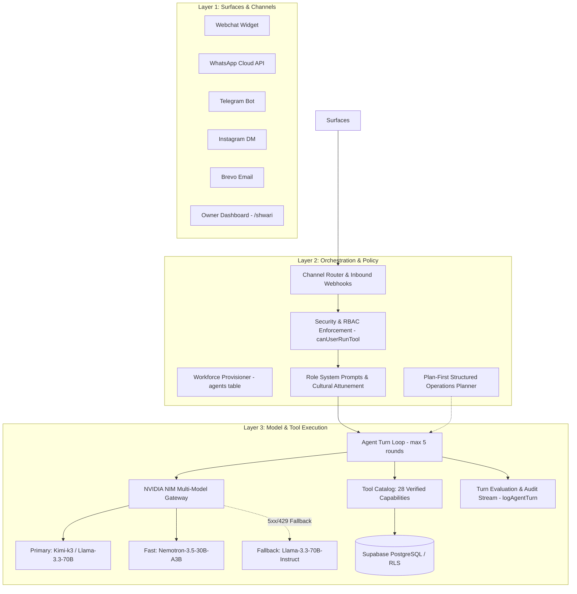

# Shwari Agent Workforce Architecture & Evaluation Guide

This document describes the production architecture, multi-model execution, security policy, and evaluation framework for the Shwari Agent Workforce.

---

## 1. Architectural Overview: The Three-Layer Engine

The Shwari AI system operates on a clean separation of concerns across three distinct layers:

### Layer 1: Surfaces & Ingestion
- **Owner Surface**: The internal Shwari Manager accessible via `/shwari` and private administrative channels.
- **Customer Surfaces**: Omnichannel endpoints (Webchat, WhatsApp Business API, Telegram, Instagram Messaging, Brevo Inbound/Outbound Email). Every customer session attaches to an immutable `tenant_id` and unique `conversation_id`.

### Layer 2: Orchestration, Policy & Prompt Assembly
- **Zero-Hallucination Prompting**: Dynamic orientation injected into prompts without dumping the entire catalog into context. Prompts enforce strict tool lookup before answering.
- **Audience & Cultural Attunement**: Role-specific prompts distinguish internal business management from customer-facing service. East African conversational norms (English, Swahili, Sheng) are natively acknowledged.
- **Plan-First Structured Operations**: Multi-step business setup and batch commands are analyzed by the `Planner`, translated into an executable step sequence, validated for RBAC permissions, and executed sequentially with progress feedback.

### Layer 3: Model Gateway, Tool Execution & Observability
- **NVIDIA NIM Gateway**: High-throughput inference via OpenAI-compatible endpoints with dynamic profile routing (`primary`, `fast`, `fallback`) and automatic retry with fallback on transient 5xx/429/timeout errors.
- **Tool Execution Engine**: 28 strictly-scoped tools categorized across business profile, catalog, operations, communication, and dashboard analytics. Database row-level tenancy is injected by context, never accepted as an LLM argument.
- **Continuous Evaluation & Audit Trail**: Every turn logs structured telemetry (`actor_id`, `role`, `model_profile`, `tools_invoked`, `duration_ms`, `status`) to `audit_events`.

---

## 2. Workforce Roles and Operating Directives

Every business tenant is automatically provisioned with 5 specialized agent roles:

| Agent Role | Audience | Primary Objective | Tone & Cultural Guide | Model Profile |
| :--- | :--- | :--- | :--- | :--- |
| **Manager (Shwari)** | Business Owner & Staff | Operational command, catalog configuration, analytics, staff handover | Executive, proactive, structured. Speaks direct, professional English/Swahili. | `primary` |
| **Sales** | Inquiring & Returning Customers | Product/service qualification, pricing, quote generation, unpaid order creation | Consultative, welcoming, energetic. Welcomes in Swahili (*Karibu!*), answers crisply. | `primary` |
| **Support** | Existing Customers | Order tracking, FAQs, knowledge gaps, human escalation, ticketing | Empathetic, calm, reassuring. De-escalates frustration without making unauthorized promises. | `primary` |
| **Booking** | Appointment Clients | Availability verification, booking, rescheduling, cancellation | Punctual, precise, efficient. Checks diary before proposing slots. | `fast` |
| **Orders** | Purchasing Customers | Order status lookup, payment instructions, payment claim intake | Accurate, methodical. Records M-Pesa references as unverified claims. | `fast` |

---

## 3. Strict Safety & Zero-Hallucination Guardrails

1. **Tool-First Fact Retrieval**:
   - An agent *must* call a tool (`list_services`, `list_products`, `get_payment_instructions`, `list_appointments`, `get_opening_hours`) before quoting prices, availability, or payment methods.
   - If a tool does not return an answer, the agent reports the absence of information and logs a knowledge gap (`record_knowledge_gap`).
2. **Payment Verification Barrier**:
   - **No agent possesses the authority or tool capability to mark a payment as verified or paid.**
   - Customer payment claims (e.g. M-Pesa transaction codes) are stored with `record_payment_claim` with status `claimed`. Only authenticated human staff in the Payments Dashboard can verify transactions.
3. **Tenancy Isolation**:
   - `tenant_id` is stripped from LLM function arguments. The tool execution runtime strictly derives `tenant_id` from the cryptographic user JWT or verified webhook signature.
4. **Instruction Defense**:
   - System prompts explicitly instruct agents to ignore adversarial prompt injection attempts embedded inside user messages.

---

## 4. Model Selection & Fallback Architecture (NVIDIA NIM)

The runtime leverages OpenAI-compatible endpoints on NVIDIA NIM:

- **Primary Profile (`SHWARI_PRIMARY_MODEL`)**:
  - Default: `moonshotai/kimi-k3` or `meta/llama-3.3-70b-instruct`.
  - Roles: `manager`, `sales`, `support`.
  - Purpose: High-reasoning agentic turns, multi-step tool calls, and complex customer inquiries.
- **Fast Profile (`SHWARI_FAST_MODEL`)**:
  - Default: `nvidia/nemotron-3.5-lightning-30b-a3b`.
  - Roles: `booking`, `orders`.
  - Purpose: Low-latency scheduling, lookup, and structured slot booking.
- **Fallback Profile (`SHWARI_FALLBACK_MODEL`)**:
  - Default: `meta/llama-3.3-70b-instruct`.
  - Automatic activation: Triggered transparently upon HTTP 429 (rate-limit), 5xx server errors, or gateway timeouts.

---

## 5. Structured Planning Mode

When the business owner issues a multi-step instruction to the Manager agent (e.g. *"Set up my salon with haircut at 500 KES, styling at 1200 KES, open Monday to Saturday 8am-7pm, and payment to Till 789123"*):

1. **Detection**: `isComplexCommand(text)` detects setup verbs, multi-sentence commands, or conjunctions.
2. **Decomposition**: The Planner prompt instructs the LLM to output a clean JSON execution plan with validated tool arguments.
3. **Permission Check**: Each step is validated against RBAC permissions (`canUserRunTool`).
4. **Sequential Execution**: Steps execute sequentially, collecting mutations into the transaction log.
5. **Human-Readable Output**: The owner receives a concise checklist detailing executed actions and current status.

---

## 6. Observability and Turn Evaluation

Every turn invokes `logAgentTurn` to record execution telemetry into PostgreSQL:
- **`tenant_id` & `actor_id`**: Tenant isolation verification.
- **`model_profile` & `model_name`**: LLM utilization tracking.
- **`tools_invoked`**: Tool usage and frequency analysis.
- **`duration_ms`**: Latency monitoring for SLA compliance.
- **`status`**: `success`, `failure`, `fallback`, or `error`.
- **`reply_preview` & `input_preview`**: Sampled audit trails for QA review.
